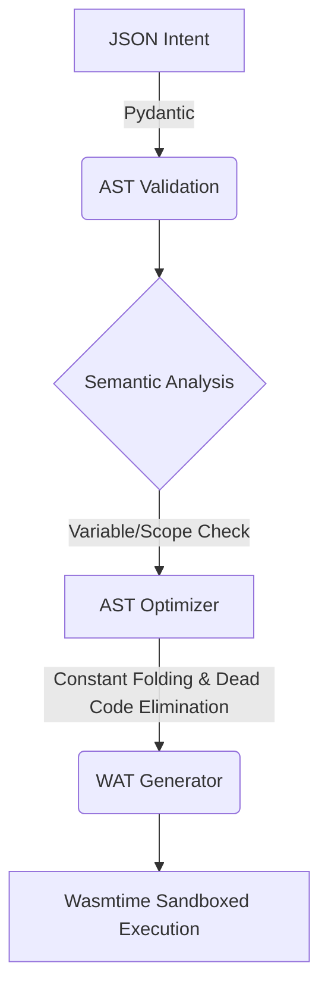

# TelosVM | AI Intent Compiler & WebAssembly Runtime

Developed a lightweight compiler that validates typed intent definitions, performs semantic analysis and optimization, lowers programs to WebAssembly, and executes them with Wasmtime.

---

## 🛠️ Compiler Architecture

TelosVM processes abstract intent through a 5-stage compiler pipeline:



### Technical Highlights
- **Typed AST/IR:** Uses Pydantic models to validate and construct the compiler's typed intermediate representation.
- **Semantic Analysis:** A Visitor-pattern pass that enforces scope rules and catches undeclared variables before code generation.
- **Optimization:** Performs **Constant Folding** and **Dead Code Elimination (DCE)**. 
  - *Benchmark:* For an `If` statement evaluating a known false constant, the optimizer entirely eliminates the branch instructions, reducing emitted WebAssembly.
- **WebAssembly Target:** Control-flow lowering maps high-level `While` and `If` nodes into Wasm's native `block`, `loop`, and `br_if`.
- **End-to-End Tested:** Pytest verifies compilation, optimization, and execution of generated WebAssembly with Wasmtime.

## 🚀 Example Compilation

Here is one real `Input → WAT → Output` example demonstrating compilation and execution.

**Input (intent.json):**
```json
{
  "type": "Module",
  "id": "main",
  "nodes": [
    { "type": "Declare", "var": "x", "value": 5 },
    { "type": "Declare", "var": "y", "value": 10 },
    { "type": "Declare", "var": "result", "value": 0 },
    { "type": "MathOp", "target": "result", "operator": "mul", "left": "x", "right": "y" },
    { "type": "CallBuiltin", "function": "print", "arg_var": "result" },
    { "type": "Return", "var": "result" }
  ]
}
```

**Compiled WAT:**
Because the AST Optimizer utilizes constant folding, the `MathOp` (`5 * 10`) is computed entirely at compile-time. No Wasm math instructions (`i32.mul`) are emitted:

```wat
(module
  (import "env" "print" (func $print (param i32)))
  (func $run (result i32)
    (local $x i32)
    (local $y i32)
    (local $result i32)
    i32.const 5
    local.set $x
    i32.const 10
    local.set $y
    i32.const 0
    local.set $result
    i32.const 50
    local.set $result
    local.get $result
    call $print
    local.get $result
    return
    i32.const 0
  )
  (export "run" (func $run))
)
```

**Execution Result:**
```bash
> telos run intent.json

> STDOUT (Wasm): 50
Execution Result: 50
```

## 💻 Quick Start

### Installation

```bash
git clone https://github.com/DARREN-2000/telosvm.git
cd telosvm

# Install the package and CLI
pip install -e .
```

### Testing

Run the end-to-end execution testing suite:

```bash
pytest tests/
```

## 📄 License

Dual-licensed under [MIT](LICENSE) or Apache 2.0.
